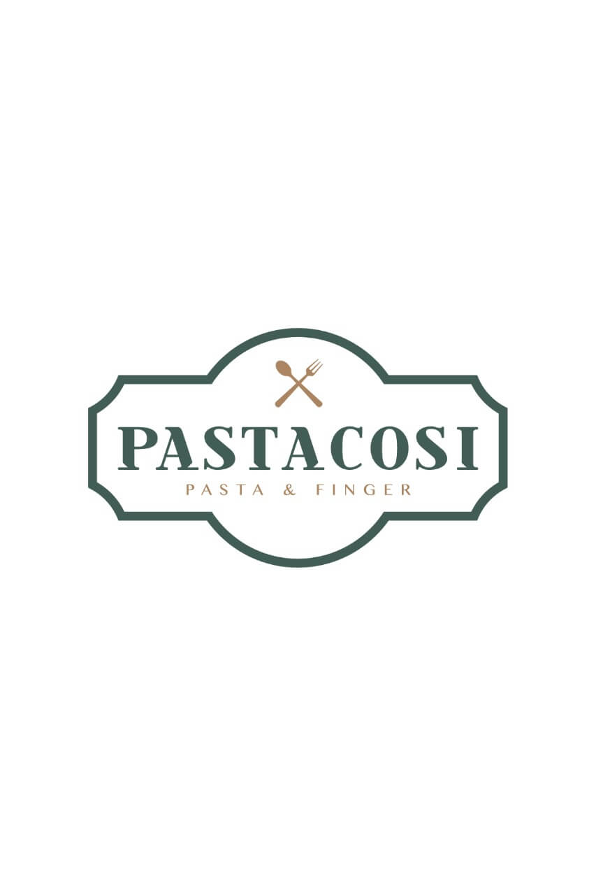
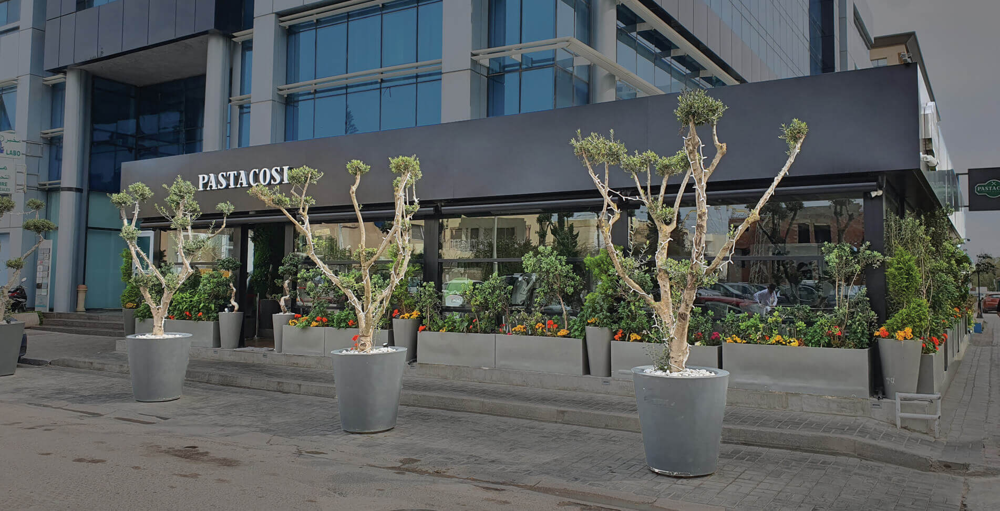
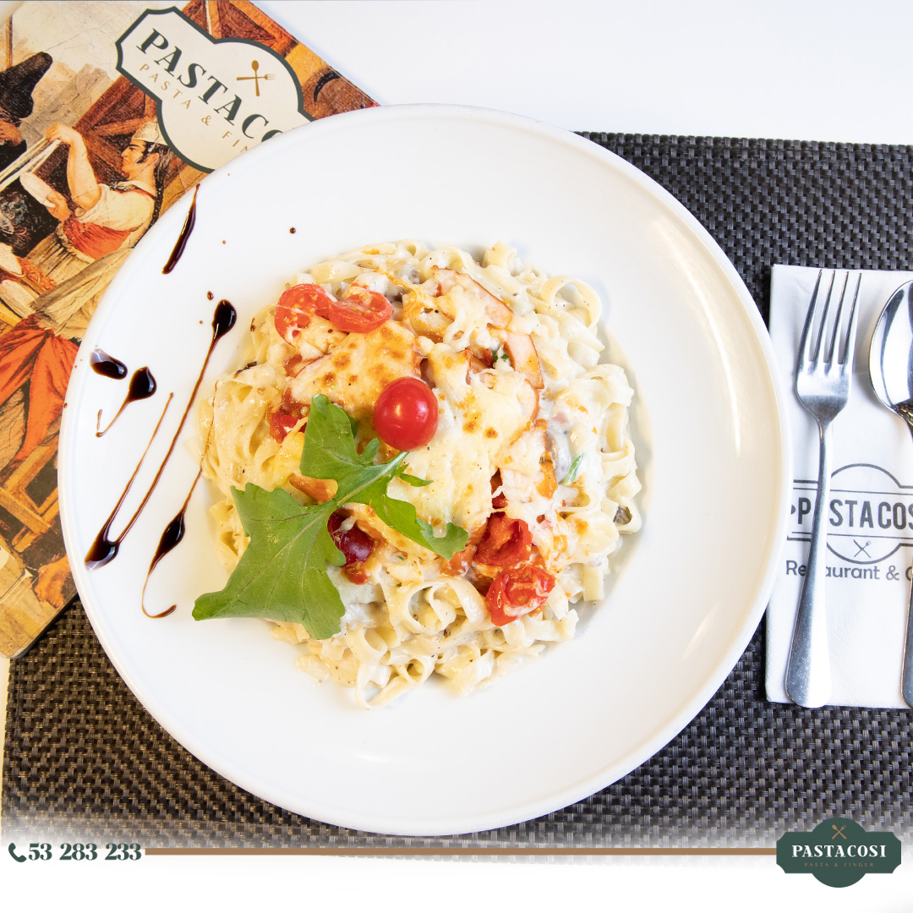
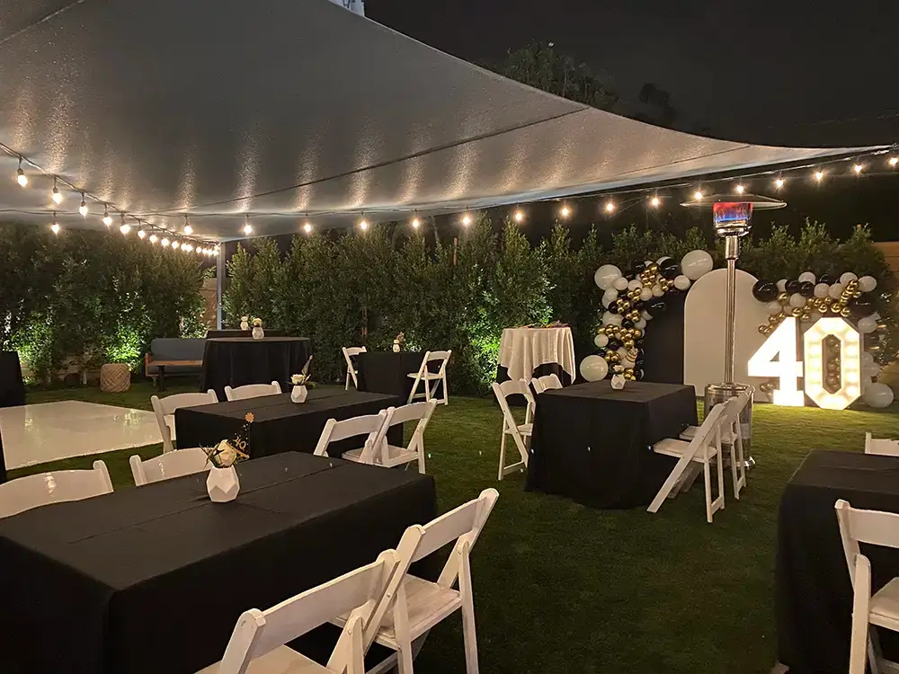
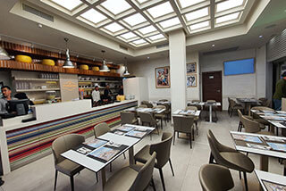

# 🍝 Pasta Cosi Restaurant Website

<div align="center">
  
  
  [](https://developer.mozilla.org/en-US/docs/Web/HTML)
  [](https://developer.mozilla.org/en-US/docs/Web/CSS)
  [](https://developer.mozilla.org/en-US/docs/Web/JavaScript)
  [](https://getbootstrap.com/)
  
  **A modern, responsive restaurant website showcasing authentic Italian cuisine**
  
  [🌐 Live Demo](#) | [📖 Documentation](#features) | [🚀 Quick Start](#installation)
</div>

---

## 📋 Table of Contents

- [🎯 Overview](#overview)
- [✨ Features](#features)
- [🖼️ Screenshots](#screenshots)
- [🛠️ Technologies Used](#technologies-used)
- [⚡ Installation](#installation)
- [🎨 Customization](#customization)
- [📱 Responsive Design](#responsive-design)
- [🔧 API Integration](#api-integration)
- [🤝 Contributing](#contributing)
- [📄 License](#license)
- [👨‍💻 Author](#author)

---

## 🎯 Overview

**Pasta Cosi** is a premium Italian restaurant website that combines elegant design with modern web technologies. Located in the heart of Tunis, Tunisia, this establishment offers an authentic Italian dining experience with a focus on fresh pasta, risottos, and traditional Italian cuisine.

### 🌟 What Makes This Special?

- **🎨 Modern Design**: Clean, professional layout with smooth animations
- **📱 Fully Responsive**: Perfect viewing experience across all devices
- **⚡ Fast Loading**: Optimized performance with efficient code
- **🔄 Dynamic Content**: JSON-powered menu system for easy updates
- **💫 Interactive Elements**: Engaging user interface with smooth transitions
- **🎯 SEO Optimized**: Built with search engine optimization in mind

---

## ✨ Features

### 🏠 **Hero Section**
<div align="center">
  
</div>

- **Auto-sliding Carousel**: 3-second interval showcase of restaurant ambiance
- **Smooth Transitions**: CSS3-powered fade effects
- **Call-to-Action Buttons**: Direct links to menu and booking sections
- **Responsive Design**: Adapts beautifully to all screen sizes

### 📖 **About Section**
<div align="center">
  
</div>

- **Video Integration**: Embedded promotional video with custom controls
- **Restaurant Story**: Compelling narrative about Pasta Cosi's heritage
- **Feature Highlights**: Visual representation of menu specialties
- **Professional Layout**: Clean typography and structured content

### 🍽️ **Dynamic Menu System**
<div align="center">
  
  
</div>

- **JSON-Powered**: Easy menu updates through `data/menu-items.json`
- **Category Filtering**: Interactive filters for Drinks, Salads, and Specialties
- **Isotope Layout**: Smooth filtering animations
- **Rich Content**: High-quality images with detailed descriptions
- **Pricing Display**: Clear, professional price presentation

#### Menu Categories:
- 🥤 **Drinks**: Fresh juices, cocktails, and beverages
- 🥗 **Salads**: Fresh, healthy options with premium ingredients
- 🍝 **Specialties**: Signature pasta dishes and Italian classics

### 🎉 **Events Section**
<div align="center">
  
  
  
</div>

- **Swiper Integration**: Touch-friendly carousel for event showcases
- **Event Types**: Birthday parties, holiday celebrations, baby showers
- **Pricing Information**: Transparent pricing for event packages
- **Professional Photography**: High-quality event imagery

### 📅 **Table Booking System**
- **User-Friendly Form**: Intuitive booking interface
- **Validation**: Client-side form validation for better UX
- **Responsive Design**: Works seamlessly on all devices
- **Professional Styling**: Consistent with overall design theme

### 🖼️ **Photo Gallery**
<div align="center">
  
  
  
  
</div>

- **Responsive Grid**: Bootstrap-powered responsive gallery
- **Hover Effects**: Smooth image scaling on interaction
- **Lightbox Ready**: Prepared for lightbox integration
- **Professional Presentation**: Showcases restaurant ambiance and dishes

### 💬 **Customer Testimonials**
<div align="center">
  
  
  
</div>

- **Swiper Carousel**: Smooth testimonial rotation
- **Star Ratings**: Visual rating system
- **Customer Photos**: Personal touch with customer images
- **Authentic Reviews**: Real customer feedback and experiences

### 📍 **Contact & Location**
- **Interactive Map**: Embedded Google Maps integration
- **Contact Information**: Complete business details
- **Contact Form**: Professional inquiry system
- **Social Media Links**: Direct links to social platforms

---

## 🛠️ Technologies Used

### Frontend Technologies
- **HTML5**: Semantic markup and modern web standards
- **CSS3**: Advanced styling with animations and transitions
- **JavaScript (ES6+)**: Modern JavaScript features and functionality
- **Bootstrap 5.2.2**: Responsive framework for rapid development

### Libraries & Frameworks
- **Swiper.js**: Touch-friendly carousel and slider functionality
- **Isotope**: Filtering and sorting layouts
- **Animate.css**: CSS animation library
- **Bootstrap Icons**: Comprehensive icon library
- **Boxicons**: Additional icon set for enhanced UI

### Development Tools
- **JSON**: Dynamic data management for menu items
- **CSS Grid & Flexbox**: Modern layout techniques
- **Media Queries**: Responsive design implementation
- **CSS Variables**: Maintainable styling system

---

## ⚡ Installation

### Prerequisites
- Modern web browser (Chrome, Firefox, Safari, Edge)
- Local web server (optional, for development)

### Quick Start

1. **Clone the Repository**
   ```bash
   git clone https://github.com/coder-aadii/pasta-cosi-restaurant.git
   cd pasta-cosi-restaurant
   ```

2. **Open in Browser**
   ```bash
   # Option 1: Direct file opening
   open index.html
   
   # Option 2: Using Python server
   python -m http.server 8000
   
   # Option 3: Using Node.js server
   npx serve .
   ```

3. **View the Website**
   - Direct: Open `index.html` in your browser
   - Server: Navigate to `http://localhost:8000`

### File Structure
```
pasta-cosi-restaurant/
├── 📁 assets/
│   ├── 📁 img/
│   │   ├── 📁 slide/          # Hero carousel images
│   │   ├── 📁 menu/           # Menu item images
│   │   ├── 📁 gallery/        # Restaurant gallery
│   │   ├── 📁 events/         # Event photos
│   │   ├── 📁 testimonials/   # Customer photos
│   │   └── 📁 logo/           # Brand assets
│   └── 📁 vdo/                # Video content
├── 📁 data/
│   └── menu-items.json        # Dynamic menu data
├── 📁 test/                   # Test files
├── index.html                 # Main HTML file
├── style.css                  # Main stylesheet
├── script.js                  # JavaScript functionality
├── .gitignore                 # Git ignore rules
└── README.md                  # Project documentation
```

---

## 🎨 Customization

### Updating Menu Items
Edit `data/menu-items.json` to modify menu content:

```json
{
  "id": "0",
  "name": "Your Dish Name",
  "image-url": "https://your-image-url.com/image.jpg",
  "price": "₹299",
  "desc": "Delicious description of your dish",
  "type": "drinks|salads|speciality"
}
```

### Color Scheme
The website uses a warm, Italian-inspired color palette:
- **Primary**: `#ffb03b` (Golden Orange)
- **Secondary**: `#5f5950` (Warm Brown)
- **Accent**: `#ff0000` (Classic Red)
- **Background**: `#dacdbc` (Cream)

### Typography
- **Headers**: "Satisfy" - Elegant script font
- **Body**: "Poppins" - Modern, readable sans-serif
- **Accents**: "Comic Neue" - Friendly, approachable font

---

## 📱 Responsive Design

### Breakpoints
- **Mobile**: 320px - 768px
- **Tablet**: 768px - 992px
- **Desktop**: 992px - 1200px
- **Large Desktop**: 1200px+

### Mobile Features
- ✅ Touch-friendly navigation
- ✅ Optimized image loading
- ✅ Readable typography
- ✅ Accessible form controls
- ✅ Fast loading times

---

## 🔧 API Integration

### Menu Management
The website uses a JSON-based system for easy menu management:

```javascript
// Automatic menu loading
const loadMenuItems = async () => {
    const response = await fetch('data/menu-items.json');
    const menuItems = await response.json();
    // Dynamic rendering logic
};
```

### Future Enhancements
- 🔄 Real-time menu updates
- 📊 Analytics integration
- 💳 Payment gateway integration
- 📧 Email notification system

---

## 🤝 Contributing

We welcome contributions to improve the Pasta Cosi website! Here's how you can help:

### Getting Started
1. Fork the repository
2. Create a feature branch (`git checkout -b feature/amazing-feature`)
3. Commit your changes (`git commit -m 'Add amazing feature'`)
4. Push to the branch (`git push origin feature/amazing-feature`)
5. Open a Pull Request

### Contribution Guidelines
- 📝 Follow existing code style
- 🧪 Test your changes thoroughly
- 📖 Update documentation as needed
- 🎨 Maintain design consistency

---

## 📄 License

This project is licensed under the MIT License - see the [LICENSE](LICENSE) file for details.

---

## 👨‍💻 Author

<div align="center">
  
  
  **Designed with ❤️ by [Coder-aadii](https://github.com/coder-aadii)**
  
  [](https://github.com/coder-aadii)
  [](#)
  [](#)
</div>

### 🌟 About the Developer
Passionate frontend developer specializing in creating beautiful, responsive web experiences. With expertise in modern web technologies and a keen eye for design, I bring digital visions to life.

---

## 🙏 Acknowledgments

- **Bootstrap Team** - For the amazing responsive framework
- **Swiper.js** - For smooth carousel functionality
- **Isotope** - For elegant filtering animations
- **Google Fonts** - For beautiful typography
- **Icons8** - For high-quality icons and graphics

---

<div align="center">
  <h3>🍝 Buon Appetito! 🍝</h3>
  <p><em>Experience authentic Italian cuisine at Pasta Cosi</em></p>
  
  **⭐ If you found this project helpful, please give it a star! ⭐**
</div>

---

<div align="center">
  <sub>Built with ❤️ for food lovers everywhere</sub>
</div>